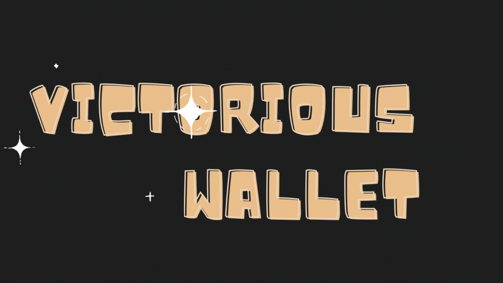

# 💼 Victorious Wallet Project
The Victorious Wallet, built on Viction, offers a seamless entry point for web2 users to access Viction without the need to create a wallet. The user-friendly features for transferring and receiving funds make buying crypto accessible. Users can conveniently purchase crypto using credit cards or conventional payment methods, bridging the gap between traditional web2.




## ✨ Features

- **Easy Access:** No need to create a separate wallet - get started with Viction effortlessly.

- **User-Friendly Transactions:** Enjoy a smooth experience for buying, transferring, and receiving crypto.

- **Payment Options:** purchase your wallet with crypto using credit cards or traditional payment methods.

## 🚀 Technologies Used

- **ReactJS:** A popular JavaScript library for building user interfaces, providing a robust and efficient front-end foundation for Victorious Wallet.

- **Account Abstraction:** Account Abstraction helps you experience web3 products as easily as interacting with web2, enhancing security and streamlining the user experience for a safe and accessible environment for crypto transactions.

- **Telegram Mini App:** Explore the integration of a Telegram mini app to bring additional functionality and communication channels to Victorious Wallet users.

## 🚦 Getting Started

1. Clone the repository:

   ```bash
   git clone https://github.com/your-username/victorious-wallet.git
   cd victorious-wallet
   npm install
   npm start


🤝 Contributing
We welcome contributions! If you'd like to contribute to the Victorious Wallet project, please follow our Contribution Guidelines.

🙌 Acknowledgements
Special thanks to all contributors who have made this project possible.

Enjoy using Victorious Wallet! Feel free to reach out with any questions or feedback.

    https://github.com/tuyendev2505/telebot-vic/issues
